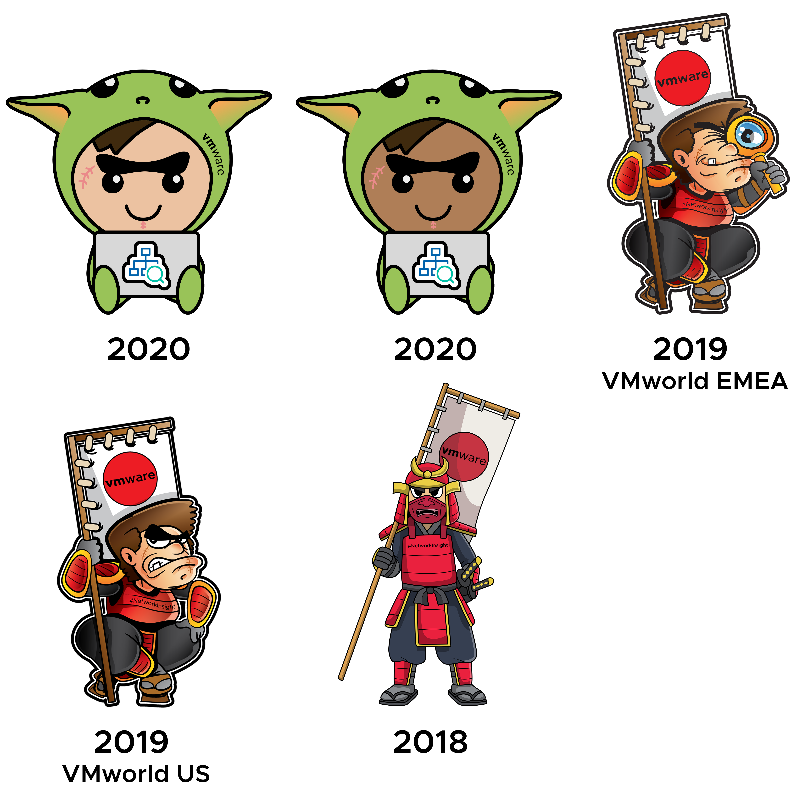

{pagebreak}

{pagebreak}

# Conclusion

I hope you have learned from this book and can use these ramblings to use vRealize Network Insight better, and that you have picked up valuable tips and tricks to solve networking productions quicker than you used to.

Together we went through the use cases for Network Insight, how the product looks under the hood, how you can use it best, how to automate against it, and so much more. Practice makes perfect, so now that you have all the tools, go out there and use them.

Make sure to get notified when new content in this book is added, by following the steps in the chapter [Book Updates](#book-updates).

Please feel free to contact me if you have any feedback on this book or unanswered questions about Network Insight. You can find me on twitter on [\@smitmartijn](https://twitter.com/smitmartijn) or my blog at <https://lostdomain.org>.

{pagebreak}

I leave you with Fred, the unofficial official mascot of Network Insight. There's a whole story about how the Samurai could see all things happening on the battlefield, but honestly, he just looks cool. ;-)

Mostly appearing on stickers, Fred has had a few makeovers in the last few years.

Let me know which one is your favorite, [via twitter](https://twitter.com/smitmartijn), and I'll send you some!
