{id: ch-application-security-planning}
# Application Security Planning

The Security Planner (or micro-segmentation planner) is arguably the most used feature for organizations just starting with Network Insight. It is the least impactful and most easy feature to turn on for an infrastructure, and results are almost instant. Point it towards the infrastructure and turn on network flow collection, and it provides insights in 1 to 2 hours after installation.

After a couple of hours of data collection, Network Insight starts generating **recommended firewall rules** for any workload (VMs, Kubernetes services, Public Cloud instances, and physical servers) that it's monitoring. It's then easy to take those recommended firewall rules and plug them into VMware NSX Data Center for micro-segmentation.

## Micro-Segmentation?

If you're never heard of micro-segmentation, you're succeeding in staying very, very far away from the networking and security world, and you're probably not reading this book. ;-)

For a quick refresher, micro-segmentation is a least-privilege architecture for the network. It is a security concept that allows only the absolute minimal amount of network access to applications and users within the data center. In the hypervisor world (and growingly outside hypervisors), VMware NSX™ allows network, security, and infrastructure admins to define granular security policies that lay the foundation for a zero-trust architecture.

Zero-trust is security turned on its head: we don't allow anything unless specifically defined in a security policy. Traditional security architectures only do this in the DMZ, if at all, leaving the doors wide open in the data center itself. Applications that have nothing to do with each other can talk to one and other. These applications have different security levels, making the weakest link the highest barrier to get over to gain access to the internal network and, by extension, other applications.

With a zero-trust architecture, using micro-segmentation, security policies (which are translated to basic firewall rules) secure each workload individually. Whether it be a virtual machine, container, or a user, making sure that workloads can only access necessary network resources and nothing more. A simple example of this would be that your company blog based on WordPress should never be allowed to talk to your CRM system.

{pagebreak}

To learn more about VMware NSX and how it helps you to do micro-segmentation, have a look at the free eBooks named [VMware NSX® Micro-segmentation Day 1](https://www.vmware.com/content/dam/digitalmarketing/vmware/en/pdf/products/nsx/vmware-nsx-microsegmentation.pdf) and [VMware NSX® Micro-segmentation Day 2](https://www.vmware.com/content/dam/digitalmarketing/vmware/en/pdf/products/nsx/vmware-micro-segmentation-day-2.pdf).

{caption: "Micro-Segmention; logical security boundaries between applications.", width: "80%"}
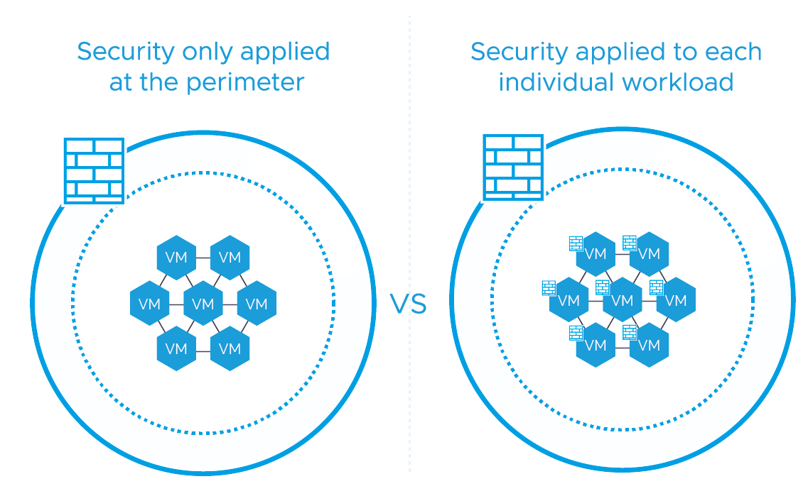

## The Challenge of Micro-Segmentation

When you start treating all your applications in a zero-trust way, there's usually one big question that arises: "Do I actually have to put in work to achieve zero-trust? Can't I just click a button?"

Achieving zero-trust, while never unachievable, definitely requires you to do the work. When you start treating your applications as if they are all in a separate DMZ, security policies need to be designed for it to work, and those security policies need to contain all network connectivity that an application needs. Forget to include a critical port in the security policy, and the application simply doesn't work.

If you put in the work, the rewards of securing your applications are worth it. Organizations around the world are doing it. Micro-Segmentation is real progress towards a more secure infrastructure, or at least it helps in limiting the blast radius of any incident.

Getting the information needed to implement micro-segmentation is the hard part. Legacy applications are everywhere, and application vendors used to be pretty bad at documenting anything related to the network (as networks were pretty flat and should "just work" -- right? Dude?). And before the voice in your head gets too loud: yes, we're still not always good with documentation. But at least most application vendors now know networks and security are a thing they need to consider.

There are a lot of undocumented applications, which forces you to resort to primitive methods of finding out what applications need. Like using port mirrors to sniff all traffic, logging into servers, and checking which ports are opened by applications, logging all traffic to a massive syslog repository, and manually create reports on which ports you need. All these steps translate to a lot of manual labor.

## Speeding up Micro-Segmentation

The micro-segmentation planner feature in Network Insight listens in on real-time network traffic and analyses that information to provide you with a starting point for implementing micro-segmentation. It does this by accepting protocols like NetFlow, IPFIX, and sFlow, which almost all networking components (switches, routers, firewalls) can generate. More on the protocols later, but they all generate reports on real-time network traffic with an IP source, IP destination, protocol, and port number. The metadata of your actual network traffic.

Network Insight takes these reports with the metadata of the network traffic, links them to application data (virtual machines, physical servers, workloads that form the application), and generates recommended security firewall rules for your existing applications.

It provides you with a starting point for micro-segmentation. After collecting network flows for a few weeks, you can generate the recommended firewall rules and do a reality check on them. It'll tell you what exactly is happening in an unsecured infrastructure, which not necessarily means that all that is supposed to be happening. You'll discover cross-application communication, which is not supposed to happen, find that admins are accessing management interfaces (RDP/SSH) from anywhere but the management network. In any case, security policies on paper tend to get ignored when something needs to work. It happens anywhere where it's possible, don't be surprised.

## How does it work?

Network Insight takes in metadata from real-time network traffic and relates that to other data it already sees from the infrastructure. This way, it can determine which network flows belong to which virtual machine, container, or application. It knows which network flows are currently in use by the application, shows this in a very presentable way, and makes recommendations on the required firewall rules needed to micro-segment an application.

It is also keenly aware of the VMware NSX dynamic security policies. It uses Security Groups and Security Policies to group VMs, networks, applications (or whatever fits the best scope) to make sure the number of firewall rules is minimized to the bare minimum. Hence, it creates the best manageable configuration.

## NetFlow, IPFIX & sFlow

Ingesting the network traffic flows can happen via three different protocols: **NetFlow**, **IPFIX**, and **sFlow**. All three protocols do the same thing, only in different formats. They usually run on switches or routers where all the network traffic goes through.

In the basics, they listen to all network traffic sent over the network device and keep a list of traffic flows in a format of source IP, destination IP, protocol (TCP/UDP/ICMP/...), network port number, the number of packets and the size of the packets in bytes.

The network device then sends out this list out to a collector for processing. In this case, Network Insight is the collector.

NetFlow originated from Cisco in 1996 and can be used on a plethora of physical switches. Of course, (most) of Cisco's own network devices, but also Juniper, Brocade, Palo Alto Networks, and a bunch of other vendors support it. Network Insight supports NetFlow version 5 through version 10.

IPFIX is a spinoff from NetFlow (version 10), where devices can put custom information into the headers. vSphere uses version this on the vSphere Distributed Switch (VDS). When you enable flows via the VMware vCenter registration when adding it as a Data Source, Network Insight configures the VDS to send IPFIX to the Collector.

sFlow is short for sampled-flow, which means it stores 1 out of *N* packets. Standards for *N* are in the range of 200, 500, or even 2000. The higher you go, the lower the completeness is of the incoming data. Sampling is done to ensure the scalability of the protocol and to make sure the network device is not overloaded. Most devices that only support sFlow don't have a lot of processing power for anything other than forwarding traffic.

I> There's much more to these protocols than I'll share here. If you want to get a deep dive (including what the headers look like), their Wikipedia pages are a good start: [NetFlow](https://en.wikipedia.org/wiki/NetFlow), [IPFIX](https://en.wikipedia.org/wiki/IP_Flow_Information_Export), and [sFlow](https://en.wikipedia.org/wiki/SFlow)

An important note is that you cannot use sampling if you want to capture the right flows. Sampling means that just a sample of the data is reported; for example, 1 out of 10 flows. Considering Network Insight recommends firewall rules to be applied on an application, you don't want to have 10% of the required firewall rules, you want 100%. If your network device cannot do non-sampled flows, find another way to get full visibility.

While sFlow is supported, I generally would not recommend using it if you have the choice between NetFlow and sFlow. If you only have the option for sFlow, try to get a non-sampled data stream and be more vigilant in determining whether the recommended firewall rules are complete.

More information on how Network Insight ingests and processes incoming network flows is in the chapter [Flow Processor](#ch-flow-processor), which is under [Architecture](#ch-architecture).

## Configuring Data Sources for NetFlow, IPFIX & sFlow

To collect network flows from your environment, a flow data source has to be added to Network Insight. If you're running a vCenter data source, you can enable the IPFIX configuration straight from the data source configuration page. This option configures NetFlow on the vSphere Distributed Switch and have it send flows to the Collector. Incidentally, enabling NetFlow is the only write action that Network Insight does.

{caption: "Enabling NetFlow on vCenter"}
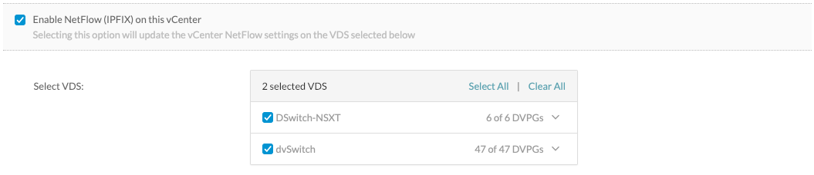

Because the VDS is the only virtual switch that supports sending NetFlow, it is required to have your VMs run on the VDS and not a standard vSwitch.

This process is the same for NSX data sources (both NSX-V and NSX-T), where you can configure NSX, so it starts sending NetFlow to the Collector, straight from the Network Insight interface.

{caption: "Enabling Distributed Firewall IPFIX on NSX", width: "80%"}
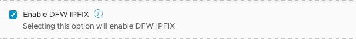

Besides using the VDS, and NSX to collect NetFlow data, you can also configure physical network devices to send NetFlow or sFlow to Network Insight. With this, you gain insight into the traffic flows between physical only hosts and not only see the flows where a virtual machine is involved. To prepare Network Insight to receive these flows from physical network devices, you need to add a "Physical Flow Collector" data source.

{caption: "Adding a Physical Flow Collector data source", width: "80%"}
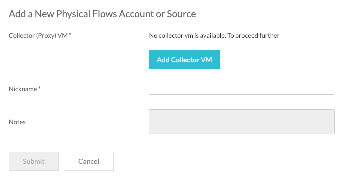

The Collector that receives the flows from the physical network devices has to be a separate Collector VM and cannot be a Collector where other data sources are present. The reasons for this are twofold:

1. Performance. Ingesting and processing network flows is the most resource-intensive a Collector can do.
2. Flow context. When Network Insight receives network flows from the VDS or the NSX Distributed Firewall, it attaches context to those flows. For example, the VM name, firewall rule, and more. It knows to look for that context when the flows come from a vSphere or NSX environment, and it knows that it does not have the same context available for flows coming from a physical network device.

I> To receive NetFlow and sFlow from physical devices (not vCenter or NSX), you need a dedicated Collector appliance for that specific purpose. You can only add a flow data source on a Collector that's not already used by other data sources.

{id: ch-analyzing-network-flows}
## Analyzing Network Flows

Let's get into the meat of the Micro-Segmentation Planner and how to use it. The network traffic flow data is presented from a very high-level for your entire infrastructure to a per-object level (per network, application, resource pool, these kinds of objects) to a very granular per-flow record level.

Starting from a high level, this is an excellent view to see what kind of behavior is happening inside your infrastructure. It shows how much of your traffic is North-South, East-West, VM to VM, and how much is routed versus switched traffic. It also gives a quick view of which network ports are used the most.

{caption: "High-level overview of network traffic behavior"}
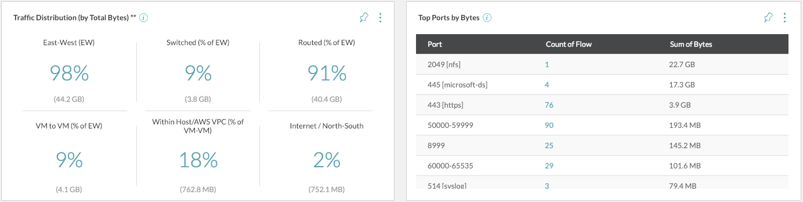

On the left of the high-level overview is what I like to call the *donut of joy*. You have to find joy in the little things of life, and for me, this is one of those things. This donut presents a user-friendly view of what network traffic flows are happening, grouped per object. By default, the slices are grouped by networks (vCenter port group), and you can change the grouping to any available workload object, for example, application, VM, subnet, vCenter folder, NSX Security Tag or an AWS VPC.

{caption: "Security Planner, Donut of Joy", width: "70%"}
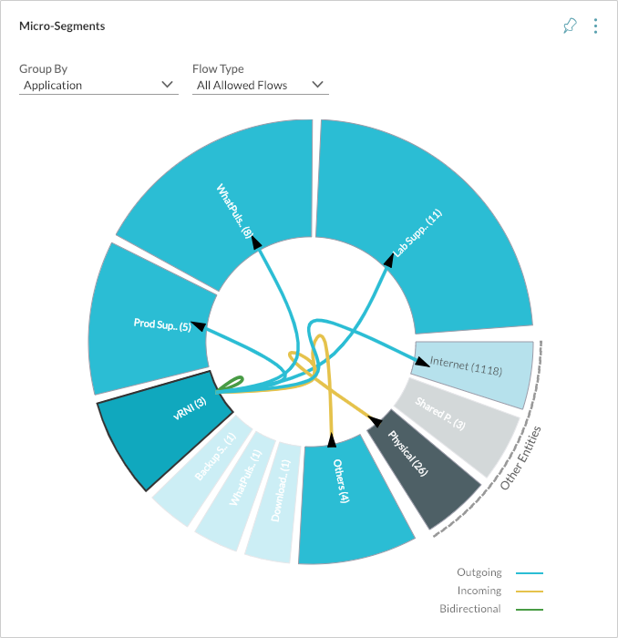

As with most of the Network Insight interface, you can click on any of the slices or connection lines and get the data that's behind the picture.

It is worth noting that the micro-segmentation planner can also be used to plan out regular zone security. While the network security industry is mostly focused on micro-segmentation these days, it is a very logical approach to have a layered security architecture. Use a micro-segmentation approach for your critical applications ("crown jewels" with access to essential data) and regular zone-based security for your less critical applications. Especially in the beginnings of a micro-segmented (brownfield) network, you should start with enabling micro-segmentation for the critical applications and work your way down.

If you either group by network or subnet, you can use the provided data to enable zone-based security.

### Group By

Each slice in the donut is represented by the group you select in the **Group By** option. You can group the slices by all available objects inside Network Insight, from Applications to Networks, to AWS VPCs, to Cluster, and more. This way, you can create the view that you need, whether you're just inspecting traffic flows between logical data centers or working to micro-segment your applications. The grouping also affects the way recommended firewall rules are displayed, which I'll talk about later.

### Scope

The donut can also be limited to a **Scope**. Put in a specific parent object (vCenter, resource pool, and more), and the donut and recommended firewall rules are limited to that specific scope. Scoping is very handy when you're working on micro-segmentation on a per data center or per cluster basis.

When grouped by application, the donut displays connections between applications and the outside world (physical servers and the internet). When grouped by VM and scoped for a specific application, the donut reveals all connections between VMs inside that application, making it easy to determine how the application is structured.

### Flow Type

There is also a **Flow Type** select box, where the integration with VMware NSX comes in to play. When you have enabled IPFIX on the NSX Data Source, the Distributed Firewall of NSX also starts sending IPFIX to Network Insight. The added value of doing so is that NSX also sends flows that blocked from going on the network by the Distributed Firewall. It also flags allowed flows with a matching firewall rule ID (if any), which makes it possible for Network Insight to correlate flows to existing firewall rules.

This integration means you can quickly see any unprotected flows, which are not protected by any firewall rules, and create sort of a 'to-do' diagram of network flows you still need to micro-segment.

I> To see protected, unprotected, and blocked flows, you need to enable IPFIX on the NSX Data Source inside Network Insight.

At the time of writing, Network Insight does not run intelligence over the discovered firewall rules from either NSX or other virtual or physical firewall to determine whether a network flow *could* hit a specific firewall. The flow records from NSX are the only flows that contain an actual firewall rule ID, which the flow is hitting, making it definitive that it's using that specified rule. For other network flow sources, Network Insight would have to deduce which firewall rule would overlap with which firewall rule to say, 'it *might* be hitting rule x' as there's no definitive proof it's hitting those rules. The Network Insight team has currently opted for certainty in this feature and only shows the blocked network flows going through NSX.

T> When working to micro-segment your environment, use the unprotected flow type to see your progress and use it to export the missing recommended firewall rules that you need to finish securing your applications.

VMware NSX is not the only source that records blocked flows. Microsoft Azure flow logs also log the flows that get blocked by the Azure security policies. Only when you select the **Dropped Flows** option, Azure flows will also turn up.

{id: ch-recommended-firewall-rules}
## Recommended Firewall Rules

When you open up any of the donut slices, or a directional line (the line between slices), there is a popup that displays a couple of things:

- **Services in this group**: Port numbers of services inside this slice that are being used by external hosts. For example, port 443 as a web server by users.

- **External Services Accessed**: Port numbers of services that this slice is using. For example, port 123 for NTP synchronization.

- **Flows (Incoming and Outgoing)**: The raw network flows, which supports the rest of the data. It displays a list of source & destination IP, protocol and port number, and a nice bandwidth graph of that specific flow.

- **Recommended Firewall Rules**: Based on the services inside the slice and the external services accessed data; Network Insight provides a list of recommended firewall rules you should use to micro-segment the workloads in this slice.

The Services tabs and Flow tab provides some great insight into what's running in a specific slice, and you'd be able to use that information to quickly determine what services are running in it and what services it is consuming. However, the Recommended Firewall Rules are the real actionable results.

{caption: "Recommended Firewall Rules grouped by Application", width: "90%"}
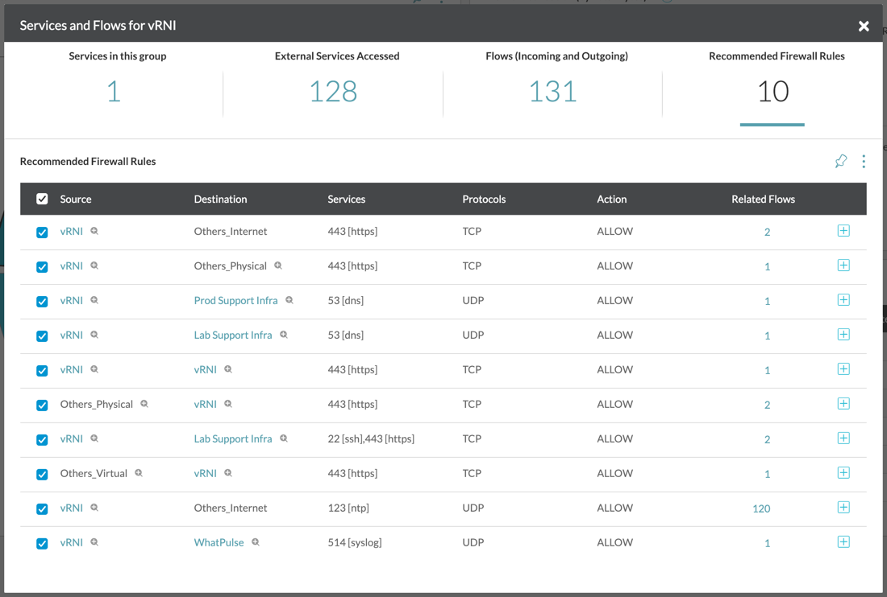

These firewall rules are what you need to enable micro-segmentation for the workloads inside the slice.

Important to note is that the Recommended Firewall Rules groups its rules based on the slice grouping you've selected for the donut. If you selected the network ("VLAN/VXLAN Overlay") as the group, you would get Recommended Firewall Rules on a per-network basis. If you select VM to group by, the recommended rules are on a per VM basis, and so on. The grouping is why I'll always recommend to put the donut in the per-application view and focus on your applications.

In real life, you would want to micro-segment based on applications, which is in the sweet spot between being too granular and too high level. Go too granular (per VM), and you end up with way too many rules and will the firewall rule list unmanageable. Go too high level (i.e., per resource pool, data center, or cluster), and your applications are not fully protected. Of course, there are exceptions where you'd want to allow shared services to have a single firewall rule, allowing the entire data center to use the shared DNS servers, but the application is what it should be all about.

Now that you know where to find the Recommended Firewall Rules and what to use them for let's talk about how to use them.

### Exporting Recommended Firewall Rules

These Recommended Firewall Rules can be the basis for your micro-segmentation project, and there are a few ways you can consume them, depending on how you're doing the actual micro-segmentation.

The first thing which you should decide is how the source and destination groups are determined. As you might recall, the source and destination groups are decided by the Group By option. Only by necessity should you use different groupings in different firewall rules, otherwise it quickly gets very confusing. So, first, decide on what level your micro-segmentation is based on.

The level of segmentation also depends on what technology is used to do the actual micro-segmentation. VMware NSX Data Center would be a natural choice, but Network Insight is not biased in providing the right information (except for the NSX targeted export, more on that in [Export as XML](#ch-export-as-xml)). If you can group workloads into applications and effect firewall rules on that level, do so. Otherwise, you can choose the lowest applicable grouping to get the rules that you can use in your security solution.

#### Export by 'Looking at it' ™

After choosing the right grouping, there are a few ways you could use the generated recommended firewall rules. The first one is the easiest; just look at them and translate them to your security solution of choice. Manageable for a small environment with not that many firewall rules.

When the environment gets a little bigger, and the firewall rules grow, this method may not be scalable. But fear not, there are other ways!

At the top right of every donut or table that shows the network flow data, is a menu. Three dots represent that menu, and it can be opened to reveal a few options. Exporting options include exporting as comma-separated values (CSV), extensible markup language (XML), and YAML (YAML Ain't Markup Language).

I> Currently, only exporting of recommended firewall rules is supported when you group by application, application tier, or security group.

I'll go through each option below.

#### Export as CSV

A CSV is a plain text file that holds values that are separated by a comma. It can be used to input into a scripting language and act on the data, or simply transform it into an Excel sheet where the data can be manually modified.

This option is used most to aggregate multiple exports together and apply the rules in one change window. It also often happens that a micro-segmented environment already has a security policy model in place, which dictates how the configuration should be applied. It'll have a naming scheme for the security policies, groups, and tags.

Network Insight provides you with suggestions on how to name these, but you might want to change those suggestions. That's where you can take the recommended firewall rules in a CSV format to get a starting point on which rules should be in place and then translate that to your security model.

#### Export as YAML

When integrating Network Insight with VMware PKS (PKS stands for Pivotal Container Service), Red Hat OpenShift, or vanilla Kubernetes, the option to export recommend firewall rules in a YAML format is enabled. As Kubernetes takes its configuration in the same format, you can use this export format and feed it directly into the container configuration files.

Keep in mind that the option to export as YAML is only enabled when the **Group By** setting is on to Kubernetes Namespace or Kubernetes Service. These are the only objects that can have security policies implemented. When exporting as YAML, Network Insight provides you with a zip file to download, which contains separate YAML files per network policy between different Kubernetes services.

{caption: "Recommended Firewall Rules YAML export"}
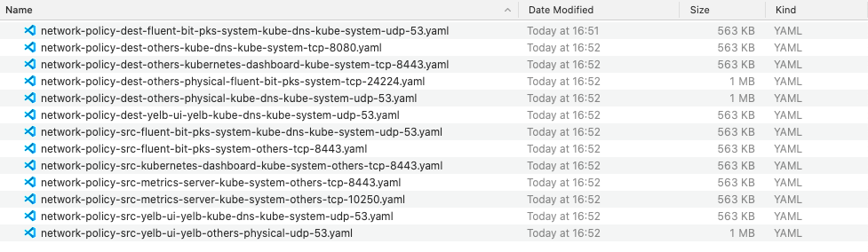

There are different files per security policy, so it's easy to edit the security policies that you actually want to apply. There could be communication between services that should not have anything to do with each other. As an example, here's the recommended security policy that makes sure my yelb-ui service has access to the centralized DNS service:

Because the files are split up per security policy, they are easy to read. It also helps that the Kubernetes network policy format is not that hard. Applying these security policies to Kubernetes is *really* simple; it's just one command. After making sure all the security policies are to be added, run this command: `kubectl apply -f *.yaml`

Make sure kubectl is connected to the right cluster, and it's selected the right namespace, of course. After applying the policies, Kubernetes makes sure they are applied to the services (or namespaces). By applying the security policies to Kubernetes, they could be enforced by VMware NSX or any of the other security tools that Kubernetes supports.

{id: ch-export-as-xml}
#### Export as XML

Lastly, there's the option to export the rules in an XML format. This export function provides you with a zip bundle that contains all needed configuration for VMware NSX for vSphere (NSX-v). XML is the format of choice when it comes to API calls for NSX-v. Network Insight uses the best practice way of micro-segmenting with NSX-v. The contents of the zip bundle contain multiple XML files that contain API bodies to create certain things: security tags, security groups, security policies, and the assignment of security tags to VMs.

You would only use this export to feed it into the NSX Importer Tool. This tool reads in the zip bundle, retrieves the XML files, and feeds them to the NSX-v API. Because this is only available for NSX for vSphere, which is going to go end-of-support in 2023[^nsxveol], I don't expect this format to be used anymore (and won't go into it here).

[^nsxveol]: http://tiny.cc/vmw-lifecycle-matrix

Because [VMware NSX Intelligence](https://www.vmware.com/products/nsx-intelligence-analytics-engine.html) in NSX-T 2.5 and above has the same feature, a direct import from the interface of Network Insight into NSX Security Policies is not going to happen. Network Insight has a broader view of the network, though. It can recommend security policies on a much larger scale, taking physical servers, or physical zones (end-users, DMZ, test, and more) into account. It remains to be the best way to implement security policies across the entire network. NSX Intelligence can take care of the micro-segmentation inside the NSX network fabric.

I> There is another import tool that takes this XML output and imports it into the NSX Policy Manager that runs VMware Cloud on AWS. It also imports directly into NSX-T, in case NSX Intelligence is not present. This effort is an open-source Python script and [is available here](https://vrealize.vmware.com/sample-exchange/vrealize-network-insight-sample-exchange/7136).

## Using the Recommended Firewall Rules

Armed with all the information from the previous chapters, you are now able to generate recommended firewall rules based on a specific application and scope it so that you can discover its dependencies. Taking this information and fueling a micro-segmentation project is a different beast, as there are steps to be taken in a specific order. After working with different types and sizes of organizations going through segmentation projects, here's what I see as a best practice.

### Step 1 -- Application Segmentation

First, start with the application boundary and implement segmentation on that boundary. Here's where you look at the Security Planner grouped by Applications. You'll get 2 things of out this view; application dependencies (because you can see which applications use other applications) and the recommended firewall rules to segment the application.

For example, a standard 3-tiered application (web, app, and DB) would show other applications using this application. But, typically, it would only show the web servers (or maybe the app servers) being addressed by these other applications. By implementing application segmentation, you protect the application itself from unauthorized network connectivity from outside, and it would typically result in only the web servers being accessible from outside the application over ports 80 or 443.

### Step 2 -- Tier Segmentation

Depending on how big the application and its tiers are, you could skip this step. It's also a matter of how much resources (read: time) there are available for the segmentation project and how strict any regulations are that apply to an application. If the application is small enough and you want to spare some time, go straight to step 3.

It is also possible that you do not need complete micro-segmentation and the tier level segmentation is good enough, depending on your defined security policies and risk analysis. If so, this could be your last step.

I see you're still here; good! You've already protected the application from unauthorized outside connections, let's move on to intra-application connectivity. Tier segmentation is all about protecting the tiers from each other inside the same application and only allowing the necessary traffic between the web and app and then between the app and database tier. Typically, the web tier does not have any business connecting to the database tier.

Go ahead and use the Scope feature on the Security Planner to limit the view to the specific application you're working on. The default view that pops up is the view we need, grouped by Tier.

{caption: "Recommended Firewall Rules grouped by Tier", width: "70%"}
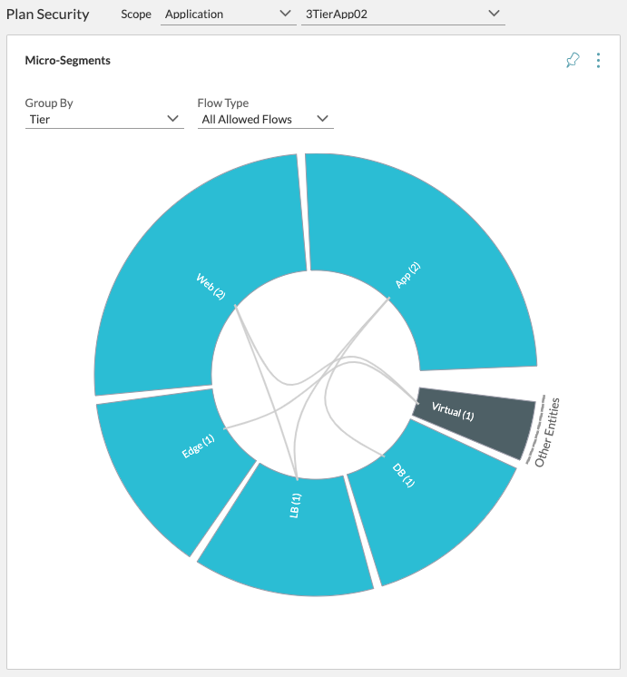

From here, you have the option to look at intra-application communication flows, get the services running inside each tier, and generate the recommended firewall rules based on the tiers. Meaning you'll get recommended firewall rules like "web needs port 80 and 443 from source any" and "web needs port 8443 to the app tier". Take these rules and implement tier segmentation. After this, you'll have protected the tiers from each other; i.e., web servers can no longer talk to the database servers.

### Step 3 -- Micro-segmentation

Now for the final step, complete micro-segmentation. Now we limit connectivity between VMs inside the same tier. For example, no web to web server connectivity (unless there's a clustering mechanism in play).

Use the Security Planner, Scope on the application you're working with, and then group by VM. The view that is presented to you is all intra-application communication on a per-VM level, and recommended firewall rules are available that tell you which firewall rules to implement on each VM.

If you have VMware NSX integrated and also receiving network flows from it, you can also select **All Unprotected Flows** on the **Flow Type** option, to make it even easier on yourself. This option only shows network flows that are not going through an NSX Distributed Firewall rule, excluding the previously implemented inter-application segmentation and the previously implemented tier segmentation. What's left is the communication that's happening between VMs inside the same tier. Take the recommended firewall rules of the intra-tier communication and implement them. And voila! You have now implemented micro-segmentation.

### Details I left out

These three steps are only about Network Insight and how to use the data that it collects and correlates with going about a segmentation project. I did not go over how you should take these recommended firewall rules and design a security policy framework around it, using everything that VMware NSX (or the other security product that you're using) has to offer. Security groups, security policies, and security tags should all be used to make the management of the micro-segmented network more straightforward and faster. There is much content out there that defined how to put together such a security framework.

## Proving Security & Auditing for PCI

Apart from planning out application security using the micro-segmentation planner, the donut of joy can also help speed up auditing processes. It lays out all communications between applications, networks, VMs, and more. Using the graphical display (the donut), you can instantly confirm, visually, that an application is not talking to anything that it's not supposed to talk to. You can save the donut for each critical application into a report and present that data to the auditors.

What also helps is the PCI Compliance Dashboard, which takes the PCI sections that are relatable to infrastructure and shows you their data in a single dashboard. Along with the snapshots of the micro-segmentation planner donut to prove network traffic flows, you can export the PCI Compliance Dashboard as a PDF and attach that to the information for the auditor to speed up the audit.

As audits do not only cover technical configurations, this data is not going to be enough for you to pass a PCI audit. It only supports the technical aspects of PCI or other compliance certifications, and you still need to put business processes in place to achieve a compliance certification.

The PCI Compliance Dashboard currently helps by displaying the following data behind these PCI sections:

{caption: "PCI Dashboard; PCI sections explained", width: 100%}
| PCI Section |  Description | How Network Insight Helps |
| :--- | :--- | :--- |
| 1.1.1 | *A formal process for approving and testing all network connections and changes to the firewall and router configurations.* | Shows all firewall rules applicable, network config changes, and network flows. |
| 1.1.2 | *Network diagram that identifies all connections between the data environment and other networks.* | Shows network topology maps & inter- and intra-application network flows. |
| 1.1.3 | *Network diagram that shows all data flows across systems and networks.* | Shows network flows in the donut and raw form. |
| 1.1.4 | *Requirements for a firewall at each Internet connection and between any demilitarized zone (DMZ) and the internal network zone.* | Shows firewall rules applicable to workloads, to determine DMZ-yness. |
| 1.3.1 | *Implement a DMZ to limit inbound traffic to only system components that provide authorized publicly accessible services, protocols, and ports.* | Same as above. |
| 2.3 | *Encrypt all non-console administrative access using strong cryptography.* | Shows all network flows that are using known unencrypted protocols. |
| 6.4 | *Follow change control processes and procedures for all changes to system components.* | Shows all security changes (firewall rules, security groups, tags & policies). |

{id: ch-application-discovery}
## Application Discovery

Micro-segmentation was first focused on the workloads themselves (VMs, containers), and it gradually shifted towards the application as a whole, which makes sense, because the application is what's important. That some VMs powers the application doesn't matter anymore; we just want the application to be available and secure.

There's been a shift towards application context inside Network Insight as well. For example, the Application Dashboard is a relatively new page where you can troubleshoot the application itself directly, with all components (VMs, network devices, and more) that support this application listed and monitored. You can directly look at the application network flows in real-time and notice any problems with the infrastructure on the application level.

To get to this application dashboard, we need to have so-called application constructs inside Network Insight.

{id: ch-application-constructs}
### Application Constructs

Inside Network Insight, there are application constructs that you can create. An application construct is pretty straightforward: it is a logical container with a name and tiers. These tiers define what components are associated with the application. By providing a virtual machine pattern (or simple the exact name), static IP addresses, Kubernetes objects, all workloads that have a specific network service running, or other vCenter or NSX objects. You can also provide a custom search query which can determine which virtual machines are a part of the tier. For example, every VM that is in a specific resource pool, folder, has a specific security tag, you name it.

Here's an example with a simple 3 Tier Application. It exists out of a Web tier, App tier, and Database tier. All tiers have VMs in there which are responsible for serving as a web, application, or database server.

{caption: "Example application construct"}
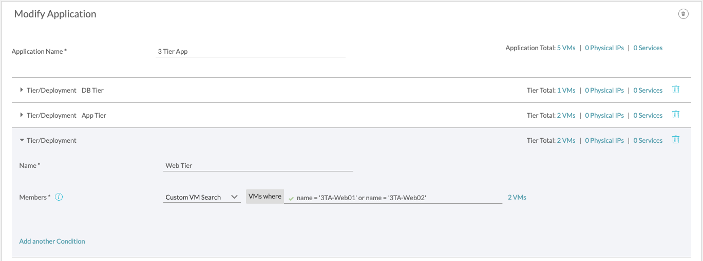

If you put the application context together with the data already in Network Insight, you get a full-stack view. You can then do application-specific tasks like micro-segmentation planning, monitoring, and troubleshooting.

You should always aim to have your entire application context synchronized to Network Insight. So, create those application containers.

Through the magic of telepathy, I hear you thinking "I have a couple thousand applications with more virtual machines supporting those applications, there's no way I'm going to create those application containers manually!"

Well, you're right. Don't do it manually because each time you execute a repetitive task, a kitten dies. That's why there is application discovery.

Now, these application constructs can be added in a few ways; manually, via the API, and they can be discovered directly from the infrastructure metadata or be fetched from a Configuration and Management Database (CMDB) like ServiceNow (just ServiceNow, at the time of this writing).

You can automate the creation of these application constructs by using the API and have your infrastructure automation tool (such as vRealize Automation) call Network Insights API to create it when there's an automated application deployment happening. I've got an example doing so in the chapter [Automation Use Cases](#ch-automation-use-cases). You can also use a pretty simple script to import a list of application constructs and get them in that way. Those methods depend on either having an automation tool or a complete list of your applications, which is not always the case. That's why Network Insight also does application discovery using metadata from the infrastructure itself. It can use tags, vCenter custom attributes, public cloud tags, Kubernetes labels, any tag that is attached to a workload. There's also the option to detect applications from a naming convention, or it can match up workloads listed in the ServiceNow CMDB and pull the information from there.

Important to note is that these discovery methods work independently from each other and can be run multiple times with different values. If you have multiple naming conventions in the infrastructure, just run the discovery multiple times, using different expressions for the right naming convention.

All discovery methods have the same output and workflow to use, which makes it easy to get the hang on them. Let's go through each of the discovery methods and see how they work. I'll use the first method, tags, to go through the wizard in-depth to lay out the flow and use that foundation in the discovery methods that follow. So, even if you don't use tagging, it's wise to go through the next chapter before you move on to the naming convention or the CMDB discovery methods.

### Tags or Custom Attributes

VMs, instances in the public cloud (AWS EC2 or Azure VMs), and Kubernetes workloads can have tags or labels to give them a little more context into what they are for. These tags are free text, so they can indicate anything that you'd like. An everyday use case for these tags is to indicate which application a specific workload is a part of and what role (tier) it fulfills inside that application.

Infrastructure automation platforms like vRealize Automation can also tag deployed workloads with their respective application name and tier name, as defined inside the blueprint that is being used to deploy these applications. In any case, let's focus on an example using vCenter custom attributes.

Tags and custom attributes are going to be used intertwined in the upcoming paragraphs, as Network Insight uses the generalizing term tags when it's referring to a key-value tag. Inside vCenter, the key-value tag is called a custom attribute.

Inside vCenters' Tags & Custom Attributes page; you can define a custom attribute that exists of a key and value set. Both are free text; the key can be used to name the custom attribute, and the value can be set on each VM separately.

{caption: "Application Construction Definition"}
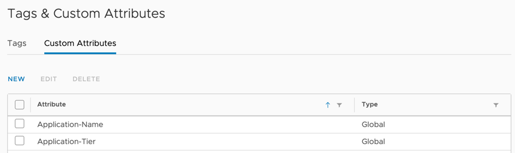

In the above screenshot, I have defined 2 custom attributes called **Application-Name** and **Application-Tier**. These attributes can then be placed on a VM and given a value. Here's an example of 2 VMs that are a part of 2 different applications and also 2 different tiers.

{caption: "Custom Attributes on a VM"}
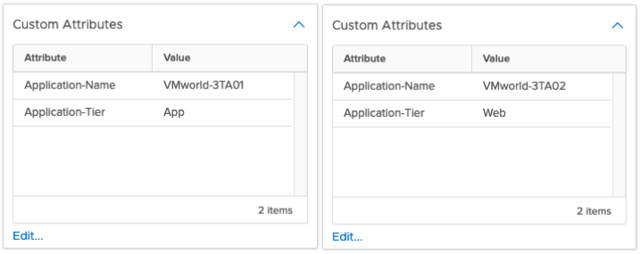

These VMs are a part of 2 different 3-tiered applications consisting of a Web, App, and DB tier. As you might deduct from the screenshots, the left VM is a part of an application called **VMworld-3TA01** and resides in the **App** tier. The right VM is a part of the **VMworld-3TA02** application and is a part of the **Web** tier.

Once these custom attributes are in place and can be used to discover the application constructs, head to the applications page in Network Insight. Once you're there, you see two tabs: Saved Applications and Discovered Applications. The saved applications are available throughout the system and have infrastructure data (VMs, flows, events, and more) correlated to them. Using the discovered applications makes it easy to fill up the saved applications.

There are three discovery methods available, and each has its sub-tab: Tags, ServiceNow, and Name. Let's focus on the Tags page for now.

You're presented with a brief wizard-like flow where you first can indicate a Scope. This scope is a way to limit the discovery to a specific section of the infrastructure. For example, you can select a vCenter, AWS VPC, Resource Pool, Subnet, any object that Network Insight can relate to a workload.

{caption: "Application Discovery using Tags"}
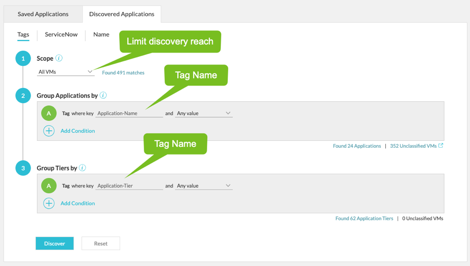

After selecting the scope, it'll ask you for the name of the tag for the application name. In the case of this example, I've selected **Application-Name** as the custom attribute that it will be using to discover the application names. You can also limit the tag value discovery by changing the "and Any value" that's to the right of the tag name. Scoping allows you to limit the discovery to specific application names and ignore the rest.

When the name of the tag for the application names is in place, you can move on to specifying the tag name for the tier discovery. I've selected the custom attribute **Application-Tier** here. You can also limit the discovered tiers by specific names. For instance, if you only want to discover the tiers called App, DB, and Web, you can fill out those names to the right of the tier tag name.

On each step, you'll see how many applications and tiers the discovery is discovering. You can click on the **Found x Applications \[Tiers\]** links and get a list of the results to see if it's matching your expectations.

One other thing to note is the mention of **Unclassified VMs**. This shows up on the other discovery methods as well and is a way to see which VMs are not involved in the current discovery. In this case, it means that there are **352** VMs that do not have the application tag and that they are not a part of the application discovery results.

This brings me back to an earlier point that you might have multiple ways of documenting applications in your environment. You might have different tag names for applications or tiers, or you might have multiple different naming conventions. This just means that you would have to run the discovery process multiple times with different settings. The goal is to get the Unclassified VMs counter to 0.

But there's a caveat; the unclassified VM counter is only counting VMs that are not classified within the current discovery settings. When you've already got saved applications based on different tags, it does not exclude the VMs that are already part of a previously discovered (and now saved) application. To exclude VMs that are already a part of an application from the discovery, use the following scope:

**Scope**: `VMs where: Application is not set`

This scope will effectively only discover VMs that are not already part of an existing application. Be careful doing this if you know that there are VMs that are a part of multiple applications (like a shared database server).

Once you're done filling out the wizard, hit the **Discover** button. This takes you to the results page, with a beautiful way of displaying the discovered applications.

{caption: "Application Discovery Results"}
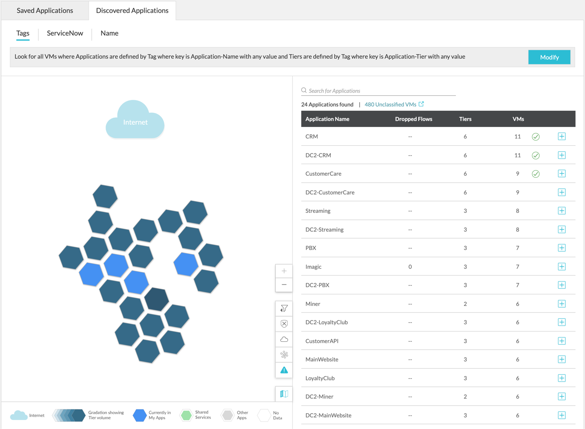

Using this honeycomb widget, the discovered applications displayed in such a way that you can quickly go through them and focus on the ones that you're looking for or filter out the ones you do not want.

There are filters available to show only the applications that are talking to the internet. Or only show the top 10/20/50/100 applications based on the amount of member VMs. You can also focus on the unprotected VMs (the ones that do not have NSX firewall rules attached to them) or filter out the applications that offer shared services (like DNS, NTP, AD, and more), or are used by a multitude of other applications.

Using all of these filters, figure out which applications you want to save and use for troubleshooting, monitoring, or security planning and hit the Save buttons on each application row of the table next to the widget.

Note: the save button is hidden on the screenshot (Figure 19) but appears when you hover over the table row.

When you click the save button, the form to save the application to the system pops up -- already filled out with the application structure and ready for you to double-check and save:

{caption: "Application Discovery Results - Form"}
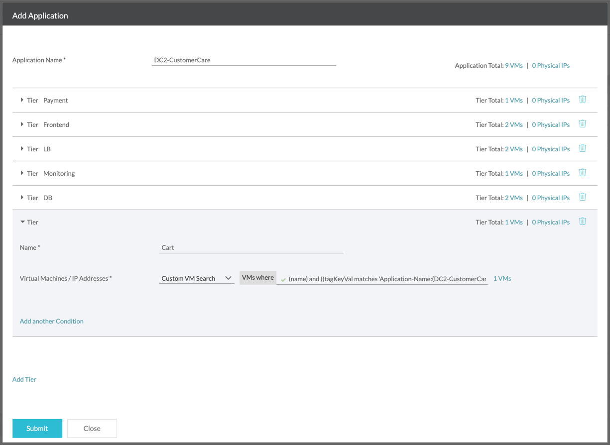

Once you hit the Submit button, the application is saved to the system, and Network Insight starts correlating other objects (network flows, VMs, events, and more) with it.

{pagebreak}

### Naming Conventions

When your infrastructure uses a naming convention that indicates which application a VM belongs to and what tier of the application the VM is a part of, you can use the naming convention discovery method.

This discovery method takes a regular expression that you put together and applies it against the entire inventory of Network Insight. All VMs and AWS EC2 instances are combed through and checked against that regular expression, and the matches are used to form the application constructs.

Let's take a look at that regular expression first. According to Wikipedia, a regular expression is the following:

> *"A regular expression, regex or regexp (sometimes called a rational expression) is a sequence of characters that define a search pattern. Usually such patterns are used by string searching algorithms for \"find\" or \"find and replace\" operations on strings, or for input validation." [^3]

[^3]: <https://en.wikipedia.org/wiki/Regular_expression>

Regular expressions are used in scripting and programming languages to grab specific bits of text out of a large text. Ask one of your developer friends, they are most likely familiar with it, and there's a big chance they hate it (I do). The reason to hate it is because it can be used to do extremely complex things, making regular expressions complex themselves. However, we can keep it pretty simple for the usage of application discovery. Here's an example:

`(.*)-.*-.*`

This example matches **APP-TIER-VM01**, using "**-"** as a separator and grabs **APP** as the application name. There are a few things to know about this example. First; "**.\***" represents a wildcard, any type of text is matched here. The "**-**" is the separator used in the workload naming convention. And lastly, the round brackets indicate that we want to grab the bit of text that matches the expression in between those brackets. This is what we're effectively saying with this expression: match workloads that are named **SOMETHING-ANYTHING-EVERYTHING** and grab **SOMETHING** as the application name.

We can get creative with the expression and demand that there are only numbers in the last section of the name, which would result in this expression:

`.*_(.*)_[0-9]+`

This expression would match workloads named **SOMETHING\_ANYTHING\_01234** and grab **ANYTHING** as the result. The brackets at the end indicate that it matches anything that is in between those brackets. In this case, anything between 0 and 9 (so 0, 1, 2, etc.). The plus at the end indicates that you're allowing multiple of the characters inside the brackets, so multiple numbers.

There's one more example I'd like to go through before I move on: a naming convention without separators. It happens that someone decides to name their workloads something along the lines of **APPTIERVM01**, where the **APP** and **TIER** are fixed sizes; 3 or 4 characters each. In this case, we can't use the previous regular expressions as they depend on separators. In case, we have to use a fixed size regular expression, something like this:

`([a-zA-Z]{3})[a-zA-Z]{4}.*`

Taking what we've learned earlier and the fact that the curly brackets indicate how long the characters between the straight brackets should be. Then you'll see that the first bit (which we are grabbing as the result) is matching on characters between a-z and A-Z, both lower- and upper-case letters, and the 3 characters that match it. The second bit looks for letters again, for 4 characters. Then there's a wildcard that allows anything after the first 7 letters.

This expression matches workloads called **APPTIERVM01** and grabs **APP** as the result. Keep in mind that it does not match **APPWEB1VM01**, as that includes a number in the second bit. You can fix that by making the second bit look like this: **\[a-zA-Z0-9\]{4}** -- This looks for both letters and numbers for the next 4 characters.

Armed with these examples, you should be able to make your way through any naming convention that is out there. However, if you do have a different convention, there's little that regular expressions cannot match.

If you would like to learn much more about regular expressions and all possibilities, there's a lot out there. Ask your developer friends, and they'll have some examples. The implementation that Network Insight uses is the Elastic Search Regexp Query, and you can learn all about its syntax in the [Elastic Search documentation](https://www.elastic.co/guide/en/elasticsearch/reference/current/query-dsl-regexp-query.html#regexp-syntax)

Another excellent resource is the website <https://regex101com> -- which helps you learn regex and test out your knowledge.

Going through the naming convention wizard should be pretty familiar. When you go to the **Name** tab on the **Discovered** **Applications** page, you are presented with a wizard. It asks you to scope the discovery and limit the results to a specific vCenter, Resource Pool, and more.

Then you fill out the regular expression that grabs the application name. As you're typing, underneath the input box, you are presented with a small list of workloads from the inventory, and it underlines the matching bit of the workload name; you can check your syntax while you're typing. How cool is that?!

Have a look at the **Found x Applications** and **Unclassified VMs** lists to see if your results are as you expect. If so, move on to the tier regular expression and rinse and repeat the steps you made on the application.

{caption: "Application Discovery with a Naming Convention"}
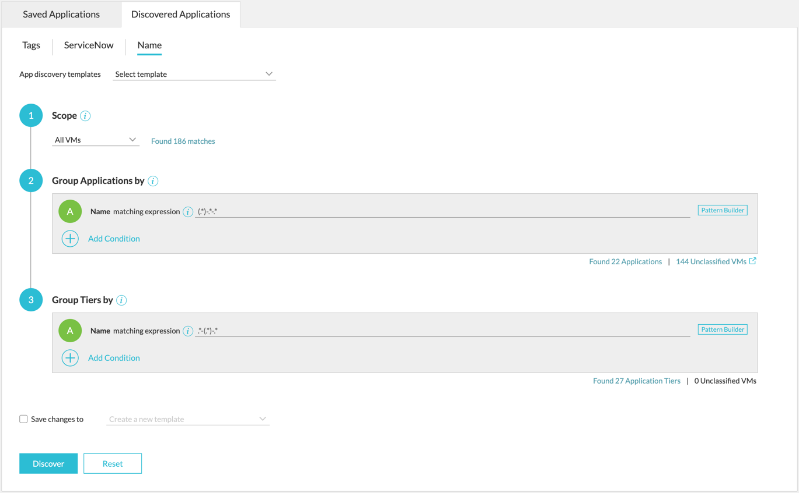

Looking at regular expressions can do a few things to a person. They can comprehend it perfectly and become a wizard, they can understand it and get away with googling the syntax they need, or they can start to ask existential questions about life itself and go on strike. If you're not a wizard, there's something inside Network Insight that can help you build the right regular expression to use called the Pattern Builder.

To the right of the input for the regular expression is a button to open it. Once you do, a new screen opens up where you can search for an example workload (or just type the name of a workload) and build a regular expression to match on it, just by clicking the positions or groupings you want to match.

{caption: "Application Discovery -- Pattern Builder"}
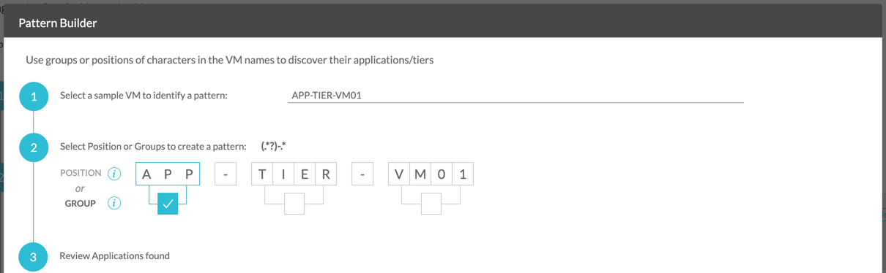

In the example above, I've selected the first group as the match, and you can see the regular expression building dynamically, just above the big workload name. It automatically recognizes groups based on the available separators, but you can also select specific character positions (remember the curly brackets?).

The Pattern Builder is there to make your life a bit easier. I know what you're thinking, though; "You saved this for \*after\* the crash course on complicated regular expressions?!?". Why, yes! And on purpose. You should know what's going on with these regular expressions, even though if you're using the Pattern Builder in the end, understand what the result means. There's a lot of other places where knowledge on regular expressions is of use.

I> Starting vRealize Network Insight 5.1, you can use different metadata as the discovery method for the application name and tier name. For example, you can extract the application name from a workload name and use the content of a tag as the tier name.
I> Also, in version 5.1, is the ability to use **Security Groups** and **Security Tags** the same way as the naming conventions, extracting parts of the security group or tag to use as an application or tier name.

{pagebreak}

### CMDB (ServiceNow)

Lastly, we've arrived at the last (and probably most boring) application discovery method, pulling data from CMDBs. Network Insight supports adding ServiceNow as a data source, and it starts looking at the configuration items (inventory) of the CMDB and their relation to each other to form the application constructs. I called this method boring, as all you have to do is add it as a data source, and the **ServiceNow** tab on the **Discovered** **Applications** page simply lists the results, and you'll be able to save the discovered applications.

I'm going to assume you know ServiceNow and the jargon that comes with it. I'm not going into how to create the applications and relations between the application, services, and virtual machines attached to those services. Instead, let's have a look at a 3-tiered application relationship map:

{caption: "Application Discovery -- ServiceNow Application Map"}
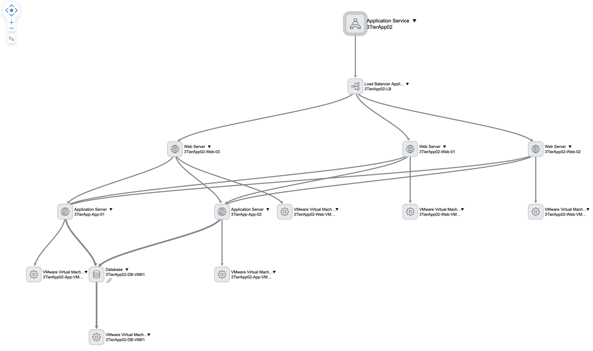

It's focused on an Application Service called **3TierApp02**, which has an entry point of a load balancer listening on port 80 and 443. The load balancer is then _distributed by_ (also the relationship type) 3 Nginx web servers, which in turn _run on_ (also the relationship type) their respective VMware VMs. The Nginx web servers _depend on_ (relationship type) on 2 application services, which _run on_ another 2 VMware VMs. Lastly, the application services _depend on_ a MySQL database service, which again _runs on_ a VMware VM.

I've underlined the relationship types in the above description, as it's crucial to have the right relationships in place for Network Insight to recognize them. Especially the service link to a workload is essential, use any of these:

- **Hosted on::Hosts**
- **Instantiates::Instantiated by**
- **Runs on::Runs**
- **Virtualized by::Virtualizes**

All the VMware VMs in this example have been discovered from the virtual infrastructure by the ServiceNow Discovery module and MID Server, so they exist in the Network Insight inventory. You could also add these VMs to ServiceNow manually, the only thing that matters is that they exist somewhere in a vCenter that Network Insight has as a data source.

Once you've got the application maps and relationships towards workloads configured inside ServiceNow, they start showing up in Network Insight, ready to be saved.

{caption: "Application Discovery -- ServiceNow Result"}
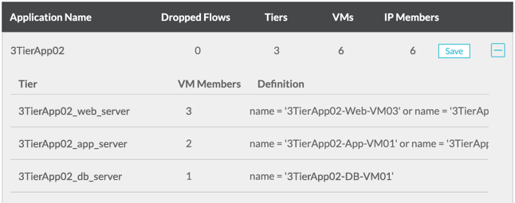
