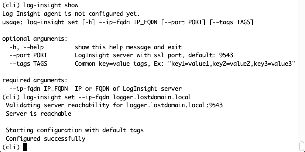
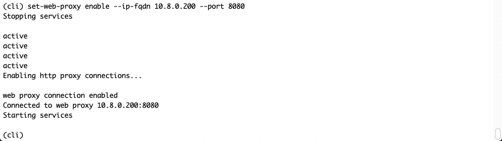

# Using the Command Line and Troubleshooting

When Network Insight is set up and acting normally, you do not need the command line interface. Apart from the initial **setup** command, the command line is not used much. It's mostly used to troubleshoot the Platform or Collector appliances themselves and change settings, such as the networking configuration. There are a few commands and other tricks to call out though, which I'll do in this chapter.

## Logging In

During the deployment of Network Insight, specifically during the setup command, you will be prompted to configure passwords for 2 users: **support** and **consoleuser**. You will be able to log into the appliances (both the Platforms and Collectors) using both of these usernames; but they serve different purposes.

The username **consoleuser** is the one that you would normally use. It has a nice shell wrapper called the vRealize Network Insight Command Line Interface (vRNICLI: yes, it needs a cooler name) and managing a Network Insight appliance should go through this user and shell wrapper. It has a lot of sanity checks and (almost; there are danger zones) makes sure that you can't damage the appliance.

Then there's the support username. This one brings you straight to the underlaying Ubuntu operating system and even allows you to switch to root by using **"sudo su -**". Don't use this user (or root access) unless directly so by VMware support or if you know what you're doing. The potential damage is catastrophic, if the wrong file is modified or wrong command executed.

I'll be focusing on the vRNI CLI functionality, which has a fair amount of commands:

{caption: "Command line list of commands"}

While the same commands exist on both of the appliances, there are some specific commands that only apply to the Collector. Run those on the Platform and it will simply output that it will only work on the Collector. For now, let's focus on the commands that will work on both.

## Commands for Troubleshooting

When something's wrong; it's DNS. Or NTP. Always. But just to be sure all bases are covered, here are a few steps to troubleshoot a Network Insight appliance.

If the Network Insight appliance is misbehaving; the web interface is not responding, connections are timing out, the Platform is not seeing a Collector and is saying it's offline; any and all issues that have to do with connectivity or reachability, here's where you start.

{caption: "Restarting services via CLI"}

Start with **show-service-status**, which will give you an overview of all critical services and their respective status. If a service is not running, you can get more information on the reason why it's not running by running **show-service-status \--debug**. This command will reach out to the service and do a few extra checks on the service and its log files.

Attempt to correct a not running service, by using **services start \<service-name\>** and see if the service stays online. If it does not, move on to checking the networking services of the appliance:

{caption: "CLI Output for show-connectivity-status"}

Running the show-connectivity-status command will take a few seconds, but it will save you time in the end because it combines a few other commands into a single command. It will show you the networking configuration, so you can check whether it's configured properly, NTP status (and if it's in sync or not), and it will test connectivity to the online upgrade and support services in VMwares' cloud. Basically, the entire networking stack is tested using this command.

If any of the network settings are incorrect (and the above output gives an error), they can be corrected using the **change-network-settings** command. Be aware that the appliance will reboot after changing these settings, but you will be warned by the CLI as well.

If NTP is not in sync, you can dive deeper into the reason by using **ntp diagnose**. This will go into a deep dive on all aspects of the NTP service, for instance; what the drift is, what time a sync last happened, it will actually do a port scan on the NTP server to see if it can reach it, and more.

### Logs

When the network settings and NTP checks out, it's time to dive into the logs. The command **log-trace** is available to view a list of different logs, search inside those logs, and monitor/follow them in real-time. You can also open up historical logs that have been rotated away. To make it a little bit easier, Network Insight allows you to look at the individual log files, but also the component (service) itself and it will figure out the latest available log file for that component. My advice is to look at the component level and not the actual log files, unless you're looking for an event at a specific date and time.

There are 2 relevant components you can look at, whilst doing your own troubleshooting: **saasservice** and **restapilayer**. These 2 services are pretty much the most important services in the Platform appliance. All data is received via the **saasservice** (the Collector sends updates via it) and the **restapilayer** is the internal API service that provides the web interface with data. If you're having issues with data collection or presentation, this is where I would start.

{caption: "Listing available log components and following the saasservice"}

Using **log-trace list components**, a list of available components is presented, and you can use these components to **grep** from or **follow**. In the above screenshot, you can see the list of components on the Platform appliance and the beginning of a **follow** on the **saasservice** components. For those who know their way around Linux/Unix; **follow** is essentially a **tail -f** alias.

You can see a bunch of errors in the above screenshot, related to a rogue Collector that is sending this Platform updates, whilst it's not registered with the Platform (meaning the Platform is ignoring its messages). As there are a lot of possible messages and I don't have to space to list them all; always look for something in the "ERROR" category and interpret the message to the best of your ability. The messages themselves are pretty self-explanatory, most of the time.

If you're looking errors that might have occurred at a specific date and time, you can either open up the right log file using **log-trace display** and look for errors manually; or you can search the logs using **log-trace grep**:

{caption: "Searching in logs"}

If you're still lost and have not found an indicator for what's causing your issue; it is now time to open a VMware support case and provide them with the support bundles and open up the support tunnel for them to have a looksie.

## Configuring Syslog

All Network Insight appliances have a vRealize Log Insight agent installed, which will forward logs to a syslog server. However, it's not enabled or configured by default. I highly recommend enabling syslog on all appliances so there's a central place to look at the logs. Both of the Network Insight appliance types do keep a history of logs, but they get rotated away. Busy systems will only keep a few days' worth of logs. When all logs are forwarded to a central log repository; you can decide how long to keep them.

{caption: "Configuring the vRealize Log Insight agent"}

The above command is pretty straightforward; supply the IP address or fully qualified domain name of the Log Insight instance, provide an optional port number if the CFAPI protocol is not running on its default port (9543) and provide optional tags.

These tags are interesting if you would like to pass on extra information in the log messages. They will be recognized by Log Insight and you will be able to search and filter on, think of them as identifiers for the specific appliance you are currently configuring.

  ------ -----------------------------------------------------------------------------------------------------------------------------------------------------------------------------------------------------------------------------------------------
  INFO   When you configure syslog via the web interface, you only have the option to send out syslog over UDP, which is unencrypted. However, if you use the log-insight command to configure syslog to Log Insight; it will be encrypted by default.
  ------ -----------------------------------------------------------------------------------------------------------------------------------------------------------------------------------------------------------------------------------------------

## Configuring a Proxy

When using the Network Insight as a Service deployment model, there's a chance that the Collector, that is deployed inside your data center, has to connect out to the Network Insight service via a web proxy. This is commonly done for security reasons, where outgoing HTTP and HTTPS connections need to be screened and secured by this proxy service. As the Platform has outgoing connections towards the VMware cloud to check for updates and initiate a support tunnel (which goes over HTTPS) on demand, the Platform could also require a web proxy. In any case, the web proxy configuration is a per appliance configuration (it needs to be done on each appliance separately) and only available via the CLI command **set-web-proxy**.

{caption: "Enabling web proxy"}

  ------ --------------------------------------------------------------------------------------------------------------------------------------------------------------------------------------------------------------------------------------------------------------------------------------------------------------------------------------------------------------------------------------
  INFO   In the on-premises deployment, communication between the Collector and Platform will not go through the web proxy. Only connections to the upgrade and support tunnel services will be proxied. In the Network Insight as a Service deployment, communication between the Collector and Platform will go through the web proxy (as the Platform in the SaaS deployment is external).
  ------ --------------------------------------------------------------------------------------------------------------------------------------------------------------------------------------------------------------------------------------------------------------------------------------------------------------------------------------------------------------------------------------

## Platform Specific Commands

Most of the CLI commands are exactly the same between the Platform and Collector appliances, with only 3 exceptions. I'll discuss these exceptions in the following chapters.

The Platform only has a single command that is specific to it, and it's only applicable in a cluster as well. If you have a single Platform node and have not scaled it to support a large environment; this is not for you.

A Network Insight cluster can be moved between networks and change IP addresses, if needed. Let's say it was deployed in a testing environment first and after a while, you wanted to promote it and move it to the production environment. The consequence being that it needs to move to a network (typically a different VLAN) with a different IP range. As all appliances in a cluster talk to each other based on their IP address, they all would need to be informed of the network changes, using the command **update-IP-change**. Here's how the workflow looks like in a 3-node cluster:

1.  Move Platform1 into the new network
    a.  Update its IP address via the CLI using **change-network-settings**
2.  Change the IP address of Platform1 on both Platform2 and Platform3 by using **update-IP-change \<old-Platform1-IP\> \<new-Platform1-IP\>**
3.  Move Platform2 into the new network
    a.  Update its IP address via the CLI using **change-network-settings**
4.  Change the IP address of Platform2 on both Platform1 and Platform3 by using **update-IP-change \<old-Platform2-IP\> \<new-Platform2-IP\>**
5.  Move Platform3 into the new network
    a.  Update its IP address via the CLI using **change-network-settings**
6.  Change the IP address of Platform3 on both Platform1 and Platform2 by using **update-IP-change \<old-Platform3-IP\> \<new-Platform3-IP\>**

After executing these steps on all Platform nodes in the cluster, it will continue normal operation. If you have a bigger cluster, such as with 5 or 10 nodes, the same steps apply; just multiply by the number of nodes are there.

{caption: "Changing the IP address of a clustered node"}

In above screenshot, you can see an example where a Platform was moved from IP address **10.79.41.179** to **10.79.41.180**. This command was executed on a different Platform and after the changed Platform had its IP address changed via the **change-network-settings** command.

  ------ --------------------------------------------------------------------------------------------------------------------------------------------------------------------------------------------------------------------------------------
  INFO   Warning: the update-IP-change command does not check whether the new IP address is actually valid and the right Platform appliance. Make sure you enter the correct new IP address and that it is up and running before you execute!
  ------ --------------------------------------------------------------------------------------------------------------------------------------------------------------------------------------------------------------------------------------

## Collector Specific Commands

There are only 2 commands that are specifically relevant to the Collector appliance: **set-proxy-shared-secret** and **vrni-proxy**. It can happen that you have to move a collector between different Platform appliances, or if the Platform appliance went belly up for some reason (got deleted and needed to be redeployed). You can move an existing collector that had a previous relation to a Platform, to another Platform using these commands:

{caption: "Moving a Collector between Platforms"}

First, generate a shared secret by adding a new Collector VM using the web interface, under **Settings** and **Install and Support** page. Copy and paste the newly generated shared secret to the set-proxy-shared-secret command to that it will be trusted by the new Platform. Then update the IP address or fully qualified domain name of the Platform that this Collector this be reporting to using **vrni-proxy set-platform \--ip-or-fqdn \<ip/fqdn\>**. After a few minutes, you will see the Collector show up in the web interface and it will be ready to use.

Command Reference
-----------------

Just for your convenience, here's a recap of the commands that come in handy when troubleshooting Network insight or commands that are good to know.

  Appliance   Command                                          Description
  ----------- ------------------------------------------------ -----------------------------------------------------------------------------------------------------------------------------------------------------------------
  Both        log-insight                                      Show, set, enable, disable or diagnose the vRealize Log Insight agent
  Both        log-trace                                        Log files; follow them as they get filled up, grep inside them or display a specific log file
  Both        modify-password                                  Change the password of the support and/or consoleuser users.
  Both        nslookup, ping, ssh-server, telnet, traceroute   Handy troubleshooting commands.
  Both        ntp                                              Show, set, manually sync or diagnose NTP configuration.
  Both        services                                         Start, stop or restart services.
  Collector   set-proxy-shared-secret                          Set a new shared secret on a Collector. Used when moving a Collector.
  Both        show-connectivity-status                         Shows the network configuration and tests the connectivity to VMwares' upgrade and support tunnel services.
  Both        show-service-status                              List the status of all services.
  Both        support-bundle                                   Create, delete or copy a support bundle that contains all logs and configuration for VMware support to troubleshoot with.
  Both        support-tunnel                                   Enables or disables the support tunnel. This initiates a tunnel to VMware support and lets them login to your system to have a look.
  Both        telemetry                                        Enables or disables telemetry. This is performance data that is sent to VMware for analysis. VMware support might ask you to enable this when there's an issue.
  Platform    update-IP-change                                 Update the IP address of another Platform appliance. Used when you have a Platform cluster.
  Collector   vrni-proxy                                       Create a new Platform pairing. Used when moving a Collector.

Want to see the options or sub-commands for the above commands? Just try the command and it will list the help text associated with it.